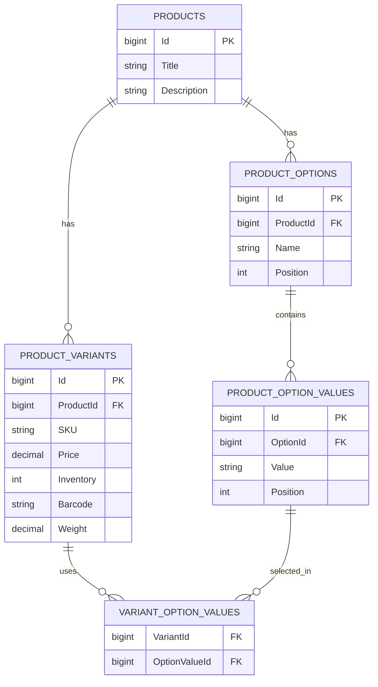

## Example

Suppose we sell a T-Shirt.

### Products

|Id|Title|
|---|---|
|1|T-Shirt|

---

### ProductOptions

|Id|ProductId|Name|
|---|---|---|
|10|1|Color|
|11|1|Size|

---

### ProductOptionValues

|Id|OptionId|Value|
|---|---|---|
|100|10|Red|
|101|10|Blue|
|110|11|M|
|111|11|L|

---

### ProductVariants

Notice that **price and inventory are here**.

| Id   | ProductId | SKU      | Price | Inventory |
| ---- | --------- | -------- | ----- | --------- |
| 1000 | 1         | TS-RED-M | 20    | 15        |
| 1001 | 1         | TS-RED-L | 20    | 8         |
| 1002 | 1         | TS-BLU-M | 22    | 3         |
| 1003 | 1         | TS-BLU-L | 22    | 0         |

---

### VariantOptionValues

|VariantId|OptionValueId|
|---|---|
|1000|100 (Red)|
|1000|110 (M)|
|1001|100 (Red)|
|1001|111 (L)|
|1002|101 (Blue)|
|1002|110 (M)|
|1003|101 (Blue)|
|1003|111 (L)|

---

## Following one variant

Take **Variant 1002**.

```
Product
└── T-Shirt
     │
     ├── Color
     │     └── Blue
     │
     ├── Size
     │     └── M
     │
     └── Variant #1002
            SKU = TS-BLU-M
            Price = $22
            Inventory = 3
```

The important thing to notice is that **the variant does not contain `ColorId` or `SizeId` columns**. Instead, it is linked to the selected option values through `VARIANT_OPTION_VALUES`.