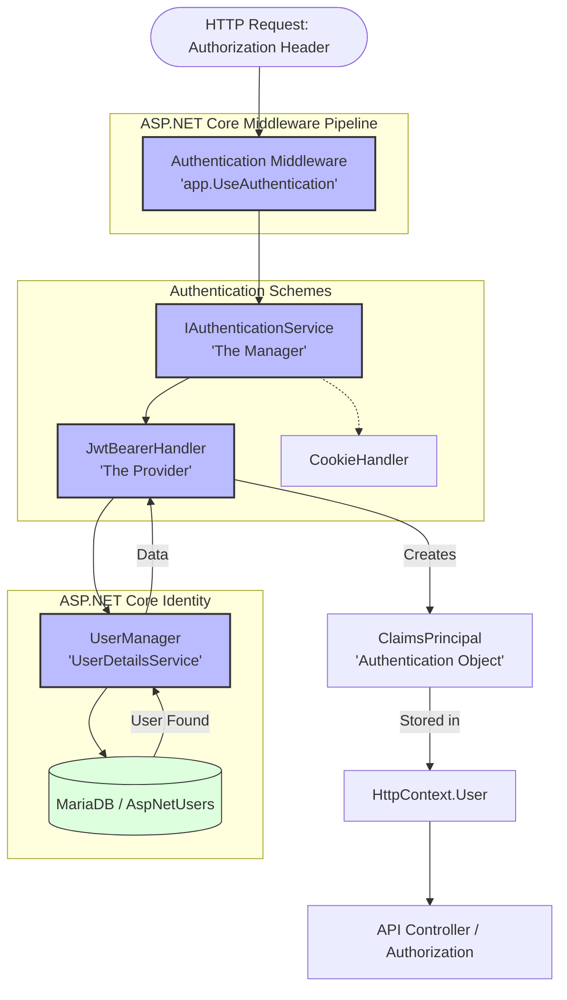
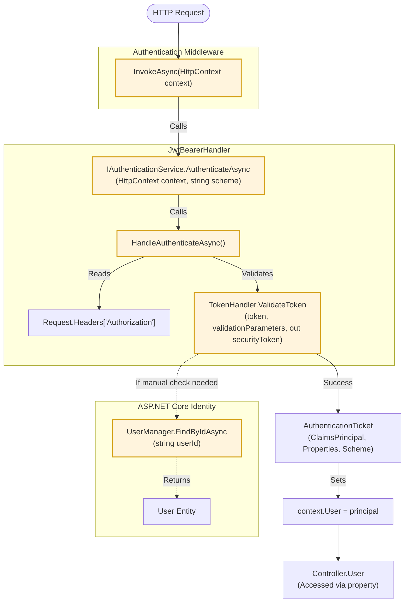

```mermaid
graph TD
    %% Define Styles
    classDef spring fill:#f9f,stroke:#333,stroke-width:2px;
    classDef dotnet fill:#bbf,stroke:#333,stroke-width:2px;
    classDef data fill:#dfd,stroke:#333,stroke-width:1px;

    %% The Request
    Request([HTTP Request: Authorization Header]) --> Middleware

    subgraph Pipeline [ASP.NET Core Middleware Pipeline]
        Middleware[Authentication Middleware<br/>'app.UseAuthentication']
    end

    %% The Core Logic
    Middleware --> AuthServiceClient[IAuthenticationService<br/>'The Manager']
    
    subgraph Handlers [Authentication Schemes]
        AuthServiceClient --> JwtHandler[JwtBearerHandler<br/>'The Provider']
        AuthServiceClient -.-> CookieHandler[CookieHandler]
    end

    %% The Data Layer
    subgraph Identity [ASP.NET Core Identity]
        JwtHandler --> UserManager[UserManager<br/>'UserDetailsService']
        UserManager --> DB[(MariaDB / AspNetUsers)]
    end

    %% The Result
    DB -->|User Found| UserManager
    UserManager -->|Data| JwtHandler
    JwtHandler -->|Creates| Principal[ClaimsPrincipal<br/>'Authentication Object']
    
    Principal -->|Stored in| HttpContext[HttpContext.User]
    HttpContext --> Controller[API Controller / Authorization]

    %% Applying Classes for clarity
    class Middleware,AuthServiceClient,JwtHandler,UserManager dotnet
    class DB data
```

```mermaid
graph TD
    %% 1. Middleware Entry
    Request([HTTP Request]) --> Middleware
    
    subgraph Pipeline [Authentication Middleware]
        Middleware["InvokeAsync(HttpContext context)"]
    end

    %% 2. The Manager Call
    Middleware -->|Calls| Manager["IAuthenticationService.AuthenticateAsync<br/>(HttpContext context, string scheme)"]

    %% 3. The Handler Logic
    subgraph Handler [JwtBearerHandler]
        Manager -->|Calls| HandleAuth["HandleAuthenticateAsync()"]
        HandleAuth -->|Reads| Header["Request.Headers['Authorization']"]
        HandleAuth -->|Validates| Validate["TokenHandler.ValidateToken<br/>(token, validationParameters, out securityToken)"]
    end

    %% 4. The Identity Layer (Optional lookup)
    subgraph Identity [ASP.NET Core Identity]
        Validate -.->|If manual check needed| UserMgr["UserManager.FindByIdAsync<br/>(string userId)"]
        UserMgr -.->|Returns| UserObj["User Entity"]
    end

    %% 5. The Result
    Validate -->|Success| Ticket["AuthenticationTicket<br/>(ClaimsPrincipal, Properties, Scheme)"]
    Ticket -->|Sets| ContextUser["context.User = principal"]
    
    %% 6. Final Controller Access
    ContextUser --> Controller["Controller.User<br/>(Accessed via property)"]

    %% Style
    classDef method fill:#fff4dd,stroke:#d4a017,stroke-width:2px;
    class Middleware,Manager,HandleAuth,Validate,UserMgr method;
```

