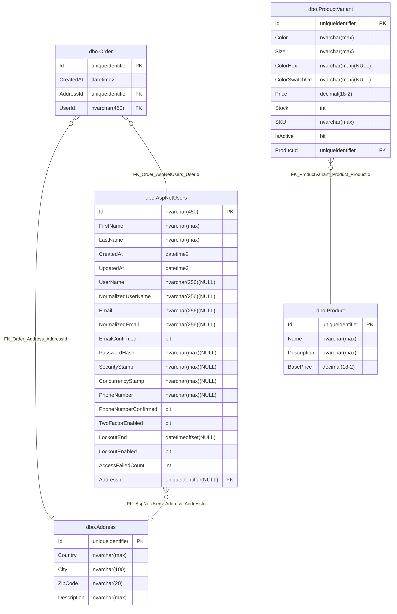

- [ ] Counting Sort, O(N+K) (where K is the range of numbers)
- [ ] Radix Sort, O(N⋅w) (where w is the number of bits in the integer).

Problem
- [ ] https://www.geeksforgeeks.org/dsa/length-of-longest-subarray-in-which-elements-greater-than-k-are-more-than-elements-not-greater-than-k/
- [ ] https://www.geeksforgeeks.org/dsa/find-subarray-with-given-sum-in-array-of-integers/
- [ ] https://www.geeksforgeeks.org/dsa/given-a-sorted-and-rotated-array-find-if-there-is-a-pair-with-a-given-sum/

